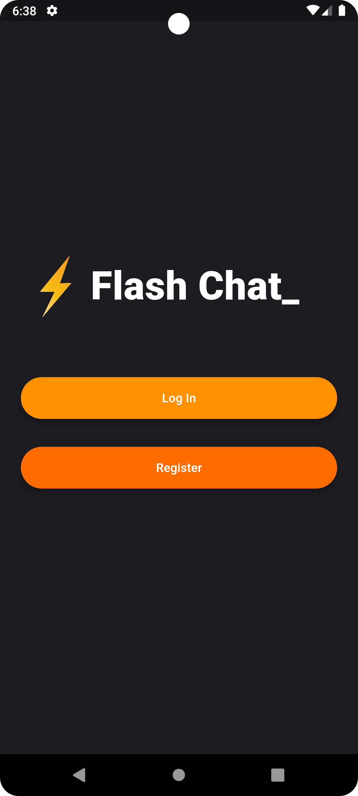
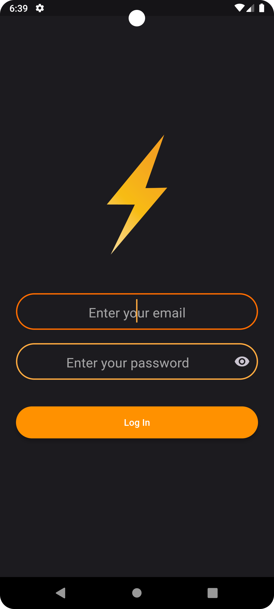
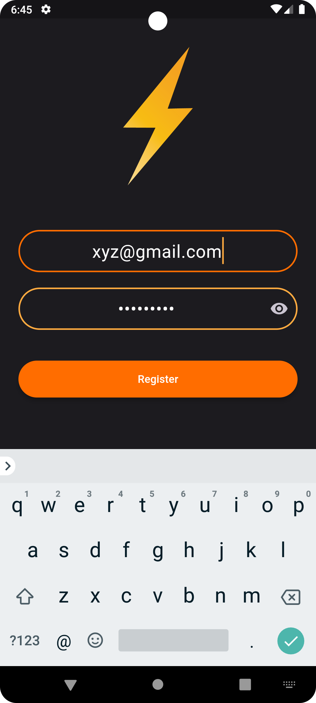
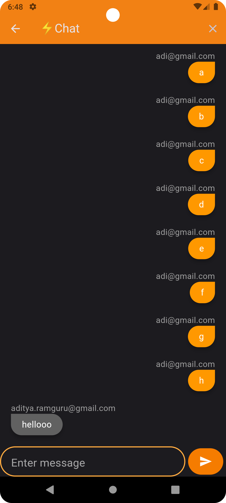

# Flash Chat

Flash Chat is a simple real-time messaging app built with Flutter and Firebase. It allows users to send and receive messages instantly, creating a seamless and engaging chat experience.

## Features


- **Real-Time Messaging:** Messages are delivered instantly, providing a real-time conversation experience.
- **User Authentication:** Users can sign in securely using a unique username and password.
- **Clean and Intuitive Interface:** The app features a user-friendly design for a smooth messaging experience.
- **Animations:** Engage users with delightful animations during login, registration, and on the welcome screen.

## Technologies Used

- **Flutter:** UI toolkit for building natively compiled applications for mobile, web, and desktop from a single codebase.
- **Firebase:** A comprehensive mobile and web app development platform provided by Google.

## Getting Started

To run this project locally, follow these steps:

1. Clone this repository:

   ```bash
   git clone https://github.com/your-username/flash-chat.git
   ```

2. Navigate to the project directory:

   ```bash
   cd flash-chat
   ```

3. Install dependencies:

   ```bash
   flutter pub get
   ```

4. Set up Firebase:
    - Create a new Firebase project: [Firebase Console](https://console.firebase.google.com/)
    - Add an Android and/or iOS app to your project.
    - Download the `google-services.json` (Android) or `GoogleService-Info.plist` (iOS) file and place it in the respective directories of your Flutter project.

5. Run the app:

   ```bash
   flutter run
   ```

## Screenshots






## Contributing

feel free to make a pull request to contribute.